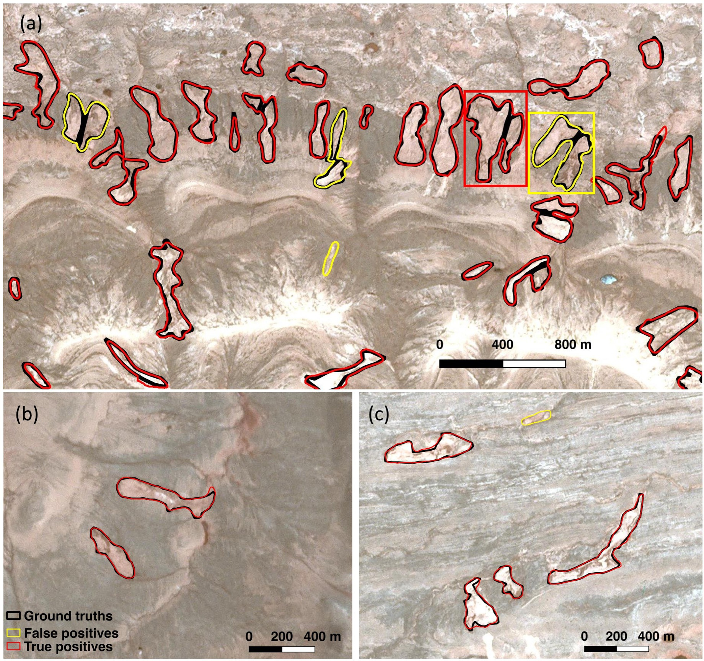

### Monitoring permafrost thaw at regional and continental scales from space

**Hightlight:** 
This study ([Huang et al., 2023](https://doi.org/10.1016/j.isprsjprs.2023.10.008)) is the first to map retrogressive thaw slumps (RTSs)—a type of abrupt permafrost thaw—on a near pan-Arctic scale using high-resolution (2 m) data. It developed an automated pipeline to process approximately 200 TB of data, combining feature extraction with deep learning to produce manageable results. Additionally, a crowdsourcing system was created to engage the broader community. Notably, a cluster of RTSs was identified in Greenland, a region where permafrost research remains limited.

I also contributed to multiple studies mapping abrupt permafrost thaw on the Tibetan Plateau and the Arctic, including Xia et al. ([2024](https://doi.org/10.1029/2024gl109616), [2022](https://doi.org/10.5194/essd-14-3875-2022)) and Huang et al. ([2022](https://doi.org/10.3390/rs14122747), [2021](https://doi.org/10.1016/j.jag.2021.102399), [2020](https://doi.org/10.1016/j.rse.2019.111534), [2018](https://doi.org/10.3390/rs10122067)). Beyond abrupt thaw, I participated in projects using SAR and InSAR techniques to derive changes in active layer thickness and to understand the gradual thawing of permafrost from the surface downward ([Wig et al., 2025](https://doi.org/10.1029/2024ea003725); [Miller et al., 2024](https://doi.org/10.5194/essd-16-2605-2024); [Chen et al., 2023](https://doi.org/10.1029/2022ea002453); [Parsekian et al., 2021](https://doi.org/10.3390/rs13152876)). I have been deeply engaged in international collaborations focused on monitoring permafrost thaw ([Yang et al., 2025](https://doi.org/10.1038/s41597-025-04372-7); [Nitze et al., 2024](https://doi.org/10.1002/ppp.2249)).

### Applying deep learing to remote sensing imagery

**Hightlight:** 
[Huang et al., 2020](https://doi.org/10.1016/j.rse.2019.111534) is the first to delineate thermokarst landforms using deep learning (DL) and high-resolution (3 m) Planet CubeSat images. As shown in the figure above, the DL output (red polygons) closely overlaps with manual delineation (black polygons), demonstrating the strong performance of the DL techniques. 
This study innovatively developed a workflow (i.e. [*BigImageMapper*](https://github.com/yghlc/BigImageMapper)) based on the state-of-the-art DL techniques and open-source packages such as GDAL, RasterIO, and GeoPandas to automatically process large imagery and GIS vector data. It allows the direct input of large remote sensing imagery and vector data into DL algorithms and saves the DL output as GIS vector files, such as ESRI shapefiles, for further validation and analysis in GIS software. 

By collaborating with colleagues in different research fields, I extended DL algorithms and the similar workflow to other reemote-sensing-based Earth Observations. We applied the DL method for delineating the calving fronts of Greenland glaciers from multi-sensor remote sensing imagery (Zhang et al., [2019](https://doi.org/10.5194/tc-13-1729-2019), [2021](https://doi.org/10.1016/j.rse.2020.112265)). We combined InSAR and DL techniques and to map and Characterize rock glaciers in the Arid Western Kunlun Mountains ([Hu et al., 2023](https://doi.org/10.1029/2023jf007206)). I also contributed to the work that used DL to map glacier lakes from multi-source satellite imagery ([Xu et al., 2024](https://doi.org/10.1016/j.srs.2024.100157)). By comparing the adaptive thresholding and DL for detecting flood extent in Houston, TX from sentinel-1A/B synthetic aperture radar, we concluded that thresholding is efficent and effective at identifying small scale floodf eatures in terms of precision, while the DL method was also effective but may miss more small scale features. 

### Other interesting reserach

<!-- glacier lakes, rock glacier, claving fronts in Greenland, flooding -->

