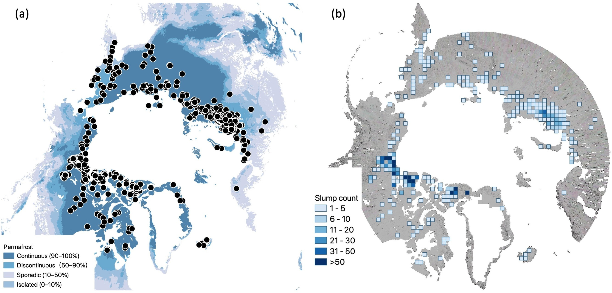

## Research 

### Identifying abrupt permafrost thaw at continental scale

**Description:** 
This [study](https://doi.org/10.1016/j.isprsjprs.2023.10.008) is the first to map retrogressive thaw slumps (RTSs), a type of abrupt permafrost thaw, at a near pan-Arctic scale using high-resolution (2 m) data. It developed an automated pipeline to process approximately 200 TB of data and combined feature extraction with deep learning for manageable results. A crowdsourcing system was also created to engage the broader community. Notably, a cluster of RTSs was found in Greenland, where permafrost research is limited.

